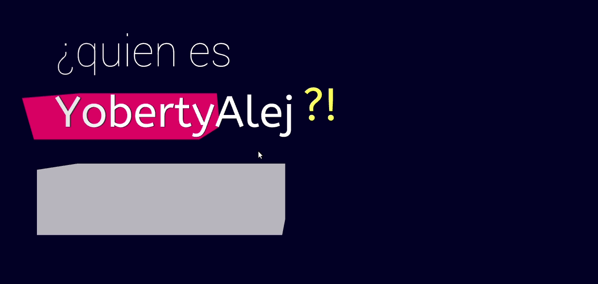

# 3D Website Animation 🌐🖼️

<p align="center">

[](https://app.netlify.com/sites/yobertyalej-webgl/deploys)

<a href="https://twitter.com/intent/follow?screen_name=yobertyalej">
</a>
</p>

Using WebGL and Three.js, we will explore the advantages and usage of the ui/ux animation



# Table of Contents

- [3D Website Animation <g-emoji class="g-emoji" alias="globe_with_meridians" fallback-src="https://github.githubassets.com/images/icons/emoji/unicode/1f310.png">🌐</g-emoji><g-emoji class="g-emoji" alias="framed_picture" fallback-src="https://github.githubassets.com/images/icons/emoji/unicode/1f5bc.png">🖼️</g-emoji>](#3d-website-animation-️)
  - [Live Demo <g-emoji class="g-emoji" alias="video_camera" fallback-src="https://github.githubassets.com/images/icons/emoji/unicode/1f4f9.png">📹</g-emoji><g-emoji class="g-emoji" alias="red_circle" fallback-src="https://github.githubassets.com/images/icons/emoji/unicode/1f534.png">🔴</g-emoji>](#live-demo-)
  - [Hello World <g-emoji class="g-emoji" alias="thinking" fallback-src="https://github.githubassets.com/images/icons/emoji/unicode/1f914.png">🤔</g-emoji>](#hello-world-)
    - [Elements <g-emoji class="g-emoji" alias="package" fallback-src="https://github.githubassets.com/images/icons/emoji/unicode/1f4e6.png">📦</g-emoji>](#elements-)
    - [Bootstrap ▶](#bootstrap-)
    - [Camera <g-emoji class="g-emoji" alias="movie_camera" fallback-src="https://github.githubassets.com/images/icons/emoji/unicode/1f3a5.png">🎥</g-emoji>](#camera-)
      - [PerspectiveCamera](#perspectivecamera)
      - [OrhograficCamera](#orhograficcamera)
    - [Controls <g-emoji class="g-emoji" alias="video_game" fallback-src="https://github.githubassets.com/images/icons/emoji/unicode/1f3ae.png">🎮</g-emoji>](#controls-)
    - [Lights <g-emoji class="g-emoji" alias="bulb" fallback-src="https://github.githubassets.com/images/icons/emoji/unicode/1f4a1.png">💡</g-emoji>](#lights-)
    - [Mesh <g-emoji class="g-emoji" alias="small_red_triangle" fallback-src="https://github.githubassets.com/images/icons/emoji/unicode/1f53a.png">🔺</g-emoji>🦖](#mesh-)
    - [Renderer <g-emoji class="g-emoji" alias="pencil2" fallback-src="https://github.githubassets.com/images/icons/emoji/unicode/270f.png">✏️</g-emoji>](#renderer-️)
    - [Resize Event <g-emoji class="g-emoji" alias="left_right_arrow" fallback-src="https://github.githubassets.com/images/icons/emoji/unicode/2194.png">↔️</g-emoji>](#resize-event-️)
    - [Init <g-emoji class="g-emoji" alias="rocket" fallback-src="https://github.githubassets.com/images/icons/emoji/unicode/1f680.png">🚀</g-emoji>](#init-)
  - [License <g-emoji class="g-emoji" alias="balance_scale" fallback-src="https://github.githubassets.com/images/icons/emoji/unicode/2696.png">⚖️</g-emoji>](#license-️)

## Live Demo 📹🔴

You can watch it live in

> WebGL Hello World https://yobertyalej-webgl.netlify.com/

## Hello World 🤔

In Lewy Blue's "Discover Three.js" e-book, we found this good example of the necessary parts
of a fluid animation

### Elements 📦

```js
/**
 * Elements/Variables of an animation
 *
 * These need to be accessed inside more than one
 * function so we'll declare them first
 */

let container; // DOM element where will be injected the canvas
let camera; // Handles the vision perspective, pov, angle, etc
let controls; // Handles the movements
let renderer; // It renders the app, using either WebGL/Canvas/SVG as its main tech
let scene; // The ambient, the objects that will be represented in the animation aka universe
let mesh; // Mesh is an object represented in the scene,  Mesh = Geometry + Material
```

We can see that the main "ingredients" of a 3D Web Animation are
at least 6, and around them we can build a minimal example of
usage on the library

A _scene_ is composed by _meshs_, _lights_, and other _objects_.
The scene is being captured by a _camera_, and controled by defined _controls_
The scene it's displayed in the screen using a _renderer_ which can be using
_WebGL_, or _Canvas_ or _SVG_

### Bootstrap ▶

```js
const init = function() {
  /**
   * Creates the animation scene, and its 6 elements
   * and starts the animation loop
   */

  container = document.querySelector("#scene-container"); // 1-6

  scene = new THREE.Scene(); // 2-6
  scene.background = new THREE.Color(0x8fbcd4);

  createCamera(); // 3-6
  createControls(); // 4-6
  createLights(); // 5-6
  createMeshes(); // 5-6
  createRenderer(); // 6-6

  // start the animation loop
  renderer.setAnimationLoop(() => {
    update();
    render();
  });
};
```

We bootstrap the animation by calling the _init_ function,
the container is selected from the DOM, the background of the scene it's set
to a solid color, and the remaning elements gets set calling some functions,
(createCamera, createControls, createLights, createMeshes and createRenderer).

We also start the _animation loop_, using the _setAnimationLoop_ method, where we
will call the render function aswell as the update function, to update any values
before render the animation

### Camera 🎥

```js
const createCamera = function() {
  /**
   * 1 of the 6 elements of the animation
   * Camera
   */

  camera = new THREE.PerspectiveCamera(
    35, // FOV
    container.clientWidth / container.clientHeight, // aspect ratio
    0.1, // near clipping plane
    100 // far clipping plane
  );

  camera.position.set(-4, 4, 10); // x,y,z
};
```

In order to have a vision of the scene we need to create a _camera_.

A camera represents how are we going to be observing the animation,
THREE.js define 2 types of cameras, _PerspectiveCamera_, and _OrthograficCamera_

After that, we set the x,y,z position of the camera

#### PerspectiveCamera

Is designed to mimic the way the human eye sees, it is the most common projection
mode used for rendering a 3D scene.

```js
PerspectiveCamera( fov : Number, aspect : Number, near : Number, far : Number )
```

The parameters that receive are elements of the _Viewing frustum_

- fov — Camera frustum vertical _field of view_.
- aspect — Camera frustum _aspect ratio_.
- near — Camera frustum _near plane_.
- far — Camera frustum _far plane_.

#### OrhograficCamera

In this projection mode, an object's size in the rendered image stays constant regardless of its distance from the camera.

This can be useful for rendering 2D scenes and UI elements, amongst other things

```js

OrthographicCamera( left : Number, right : Number, top : Number, bottom : Number, near : Number, far : Number )

- left — Camera frustum left plane.
- right — Camera frustum right plane.
- top — Camera frustum top plane.
- bottom — Camera frustum bottom plane.
- near — Camera frustum near plane.
- far — Camera frustum far plane.

```

### Controls 🎮

Then you add the _controls_, which will enable the navigation through
the scene

```js
const createControls = function() {
  /**
   * 2 of the 6 elements of the animation
   * Controls
   *
   * To move around
   */

  controls = new THREE.OrbitControls(camera, container); // Orbit controls allows us to move around
};
```

Orbit controls allow the camera to orbit around a target.

The full list of controls are

- deviceorientation
- fly
- map
- orbit
- pointerlock
- trackball
- transform

### Lights 💡

The scene needs to have an illumination source in order to be visible
by the camera, unless it would be just a dark screen

We create them and add them to the scene.

We can create as much different light sources as needed

```js
const createLights = function() {
  /**
   * 3 of the 6 elements of the animation
   * Lights
   *
   * Ambient Light and Main light pointing one direction
   */

  const ambientLight = new THREE.HemisphereLight(
    0xddeeff, // sky color
    0x202020, // ground color
    5 // intensity
  );

  const mainLight = new THREE.DirectionalLight(0xffffff, 5);
  mainLight.position.set(10, 10, 10);

  scene.add(ambientLight, mainLight); // adds the elements to the scene
};
```

### Mesh 🔺🦖

The objects in the scene

```js
const createMeshes = function() {
  /**
   * 4 of the 6 elements of the animation
   * Mesh
   *
   * The objects in the scene
   * Composed by a Geometry as skeleton and a material as texture
   */

  const geometry = new THREE.BoxBufferGeometry(2, 2, 2);
  const textureLoader = new THREE.TextureLoader();

  const texture = textureLoader.load(
    "textures/1-camera-controls/uv_test_bw.png"
  );

  texture.encoding = THREE.sRGBEncoding;
  texture.anisotropy = 16;

  const material = new THREE.MeshStandardMaterial({
    map: texture
  });

  mesh = new THREE.Mesh(geometry, material);

  scene.add(mesh);
};
```

We create 2 things, a _Geometry_ and a _material_, both of them create the _shape_ and _texture_
of our object, you can use from plane colors to external sources to create this 2 objects; After the creation we add them to the scene.

### Renderer ✏️

```js
const createRenderer = function() {
  /**
   * 5-6 elements of the animation
   * Renderer
   *
   * Creates the rendered element, and appends it to the DOM
   */

  renderer = new THREE.WebGLRenderer({ antialias: true });
  renderer.setSize(container.clientWidth, container.clientHeight);

  renderer.setPixelRatio(window.devicePixelRatio);

  renderer.gammaFactor = 2.2;
  renderer.gammaOutput = true;

  renderer.physicallyCorrectLights = true;

  container.appendChild(renderer.domElement);
};

const update = function() {
  /**
   * Perform any updates to the scene,
   * called once per frame, avoid
   * heavy computation here
   */
};

const render = function() {
  /**
   * Render
   *
   * Or 'draw a still image',
   * of the scene
   */

  renderer.render(scene, camera);
};
```

### Resize Event ↔️

```js
const onWindowResize = function() {
  /**
   * A function that will be called every time the window gets resized.
   *
   * It can get called a lot, so don't put any heavy computation in here
   */

  // set the aspect ratio to match the new browser window aspect ratio
  camera.aspect = container.clientWidth / container.clientHeight;

  // update the camera's frustum
  camera.updateProjectionMatrix();

  // update the size of the renderer AND the canvas
  renderer.setSize(container.clientWidth, container.clientHeight);
};

window.addEventListener("resize", onWindowResize);
```

### Init 🚀

We finnaly lauch the app by calling the previously defined init function

```js
// call the init function to set everything up
init();
```

## License ⚖️

MIT License

> Copyright (c) 2019 Yoberty Garcia · This site
>
> Copyright (c) 2010-2013 three.js authors · three.js https://threejs.org/
>
> Copyright (c) 2010-2018 Lewy Blue · Discover three.js https://discoverthreejs.com/
